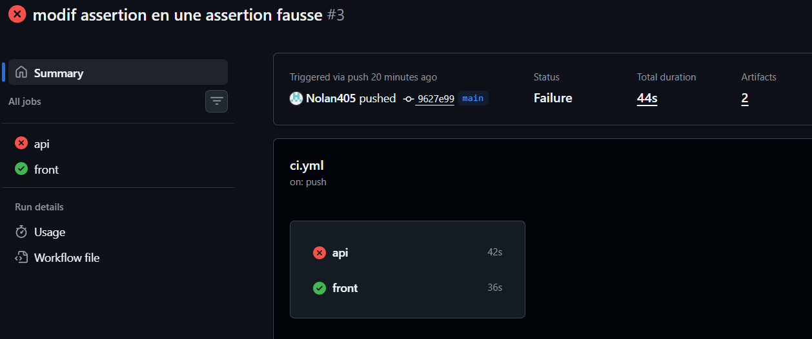
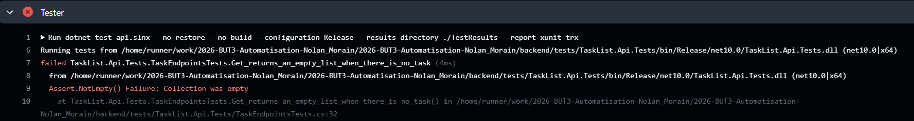
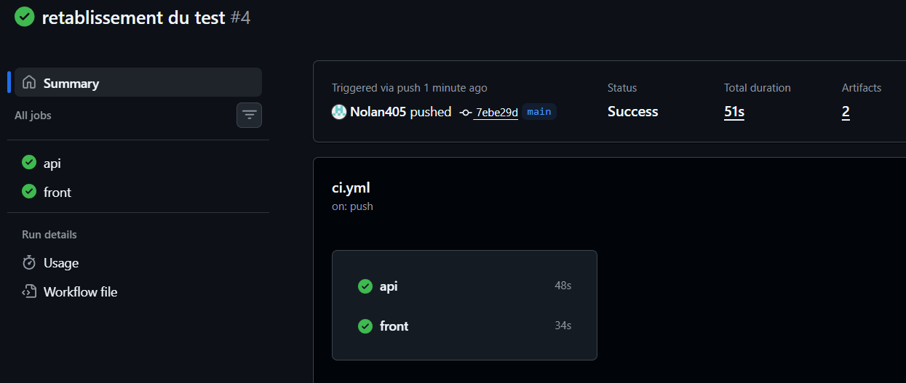

### Backend (API)

| Mesure | Avant (TP1) | Après (TP2) |
| :--- | :--- | :--- |
| Taille de l'image | 2.01 GB | 349 MB |
| Build complet (--no-cache) | 22,87s | 28,94s |
| Build après modification du code | 27,93s | 6,99s |
| UID du processus | 0 (root) | 1654 (app) |
| Durée de docker stop | pas mesuré | . |

### Frontend

| Mesure | Avant (TP1) | Après (TP2) |
| :--- | :--- | :--- |
| Taille de l'image | 63.4 MB | 63.4 MB |
| Build complet (--no-cache) | 30,07s | 37,32s |
| Build après modification du code | 34,27s | 8,13s |
| UID du processus | 0 (root) | 0 (root) |
| Durée de docker stop | pas mesuré | . |


# Casser volontairement, puis réparer

1. Quel job échoue ? L'autre s'exécute-t-il quand même ? Le job front a-t-il été affecté ?

```text
C'est le job api qui échoue. Le job front c'est exécuté qaund même et est passé au vert, et n'a pas été affecté car les deux jobs sont indépendants.
```




2. Après rétablissement du test : 



3. Combien de temps s'est écoulé entre votre push et le moment où vous avez su que c'était cassé ? C'est votre première mesure de boucle de rétroaction.

```text
Entre le push et le moment ou l'on sait que c'est cassé, il s'est passé 44s. Le job api a duré 42s avant d'échouer, pendant que le job front 36s en parralele.
```

# Rendu

1. Quelle modification a produit le plus gros gain de taille ? Et de durée ? Ce ne sont pas les mêmes — expliquez pourquoi.

```text
Séparer la construction en deux étapes (Fabrication / Exécution finale) a fait gagner de la place. Ranger l'ordre des étapes correctement a fait gagner du temps car pas besoins de retélécharger les modules à chaque modification. Le poids dépend de ce qu'on garde à la fin, alors que la vitesse dépend de ce qu'on évite de refaire.
```

2. Le délai entre le push et la détection de l'erreur (§6), et ce que vous feriez pour le réduire.

```text
Le délais est de 44s. Pour aller plus vite, on pourrait faire tourner les tests sur notre machine avant d'envoyer le code, ou ne lancer la vérification que sur la partie du projet qu'on a réellement modifiée.
```

3. Un échec de workflow que vous avez rencontré : le message, votre hypothèse, ce qui était réellement en cause.

```text
Le test a échoué avec l'erreur "Assert.NotEmpty() Failure: Collection was empty". On pouvait croire que l'API renvoyait n'importe quoi, mais c'était juste le test qu'on avait volontairement modifié pour attendre des données alors que la base était vide au départ.
```