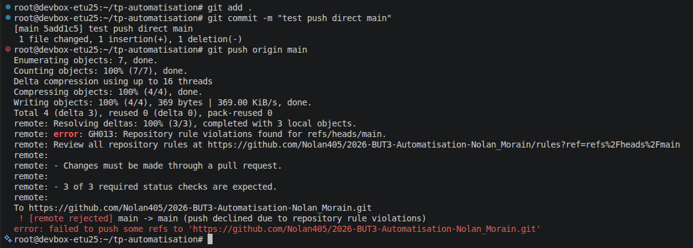

# Rapport — TP3

## 1. Erreurs de lint initiales

* **Nombre d'erreurs initiales :** 3 problèmes détectés au total par ESLint (2 erreurs et 1 avertissement). Après l'exécution de `yarn run lint --fix`, 2 erreurs de formatage/syntaxe ont été corrigées automatiquement, laissant 1 problème (0 erreur, 1 avertissement).
* **Vrai bug potentiel identifié :** L'utilisation de l'égalité faible == (eqeqeq). En JS, la conversion automatique de type (comme 0 == "" ou null == undefined) peut fausser un if et créer un bug en prod, alors que les autres erreurs n'étaient que du style ou du formatage.

## 2. Arbitrage sur le seuil de couverture

* **Option choisie :** option B.
* **Justification :** Le manque de tests vient du code initial fourni et non de mon travail. J'ai donc ajusté le seuil au niveau réel (~40%) pour créer un effet cliquet.

## 3. Scanner l'image et correctif

Pour la partie scanner l'image, Le scan Trivy du frontend a bloqué à cause de deux paquets Alpine pas à jour (libexpat / pcre2). J'ai réglé le problème en ajoutant un RUN apk update && apk upgrade --no-cache dans le Dockerfile pour forcer leur mise à jour. Après rebuild, le scan passe sans aucune vulnérabilité restante.

## 4. Position sur ignore-unfixed en production

Non, ce n'est pas une bonne idée. Cela évite juste de bloquer le déploiement, mais les failles restent présentes et exploitables. En production, il faudra surveiller ces failles et y mettre en place plusieurs protections (règles de pare-feu, restriction des accès réseau, etc).

## 5. Message d'erreur lors du push direct sur main

## 6. Revue croisée

* **Commentaire laissé sur la PR :**
  > « Good review :  
  > Couverture : option B bien.  
  > Sécurité & vulnérabilités : la cause est corrigée directement au niveau de l'image de base plutôt que de masquer le symptôme.  
  > Lisibilité : bonne séparation des jobs. »
* **Ce que la relecture a apporté :**
Pas grand-chose de nouveau, car nous avons avancé sur le TP en même temps. En rencontrant les mêmes erreurs au fur et à mesure et en nous entraidant durant la séance, nos implémentations se ressemblaient énormement avant même la relecture. Cela a surtout permis de valider le process de merge via GitHub.

## 7. Pour aller plus loin (§10)

### Dependabot
* **PRs ouvertes :** Aucune (0 PR).
* **Pertinence :** Pas toujours utiles, elles ciblent souvent des outils de dev sans impact en prod.
* **Risque du merge aveugle :** Casser l'application ou injecter du code compromis.

### Épingler par commit SHA plutôt que @v4
* **Sécurité :** Un tag comme `@v4` peut être modifié ou piraté pour pointer sur un code malveillant. Le commit SHA est immuable : le code exécuté ne changera jamais.
* **Maintenance :** Plus lourd. On ne reçoit plus les petits patchs automatiquement et il faut mettre à jour les hashs à la main.

### Durée du workflow et parallélisme
* L'augmentation du temps total **n'est pas égale** à la durée du job `securite`.
* Comme les trois jobs tournent en parallèle, le temps total du workflow dépend uniquement du job le plus lent (*chemin critique*). Le job sécurité n'augmente la durée globale que s'il dépasse le temps d'`api` ou `front`.